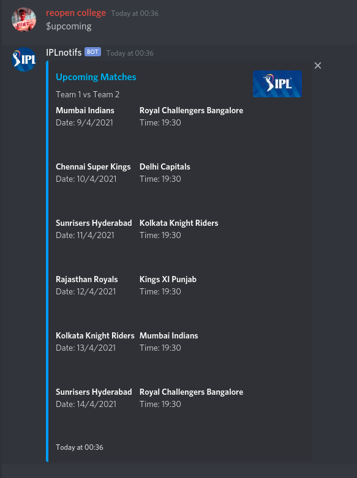
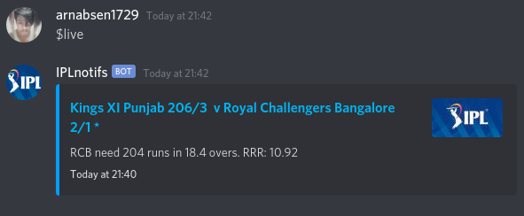
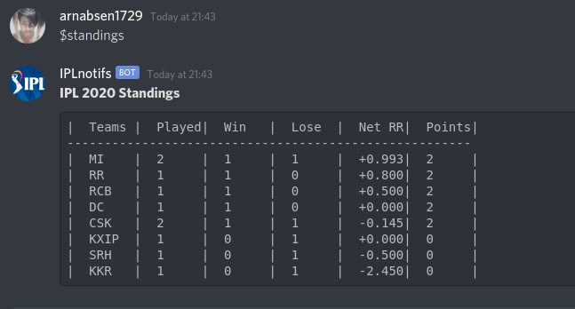
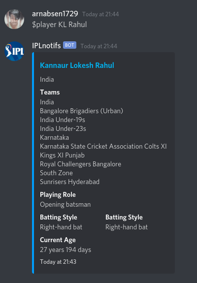

<div align="center"><h1>IPL Stats (Discord Bot)</h1></div>


[](https://github.com/arnabsen1729)

## Description

This bot will give quick and brief updates regarding the IPL 2020. It can display the standings, schedule, live scores, and player stats.

## Usage

Every command given to the bot should be prefixed by `$`. 

```
IPL Notifs Commands:-  
upcoming:      Schedule of all upcoming IPL matches(at most 6)
live:          Live Score
standings:     Current Standings
player:        Player Info e.g $player Patt Cummins
```

These are the previews:-

`$upcoming`



`$live`



`$standings`



`$player`



## Technologies Used:

1. **Discord.js** : For making  the discord bot
2. **Axios** : For fetching data
3. **Cheerio** : For scraping the IPL standings from the official website 

For the other datas I have used the [Cricapi](https://cricapi.com/). They have a really nice collection of cricket related APIs

